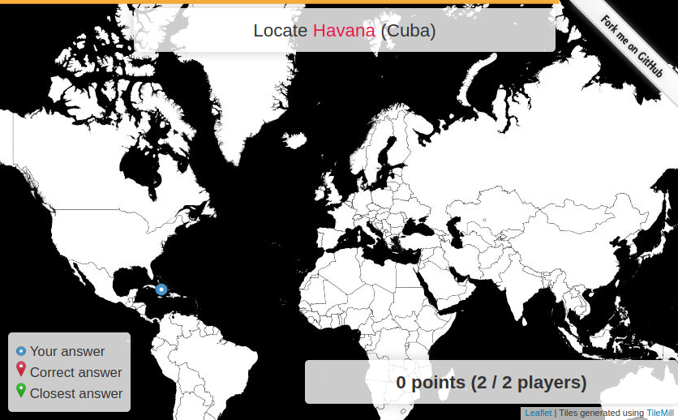
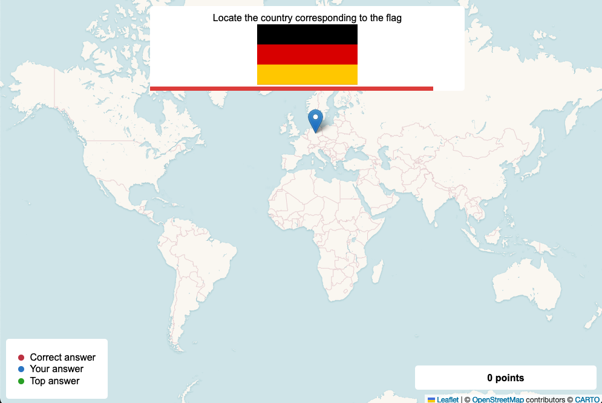

# Posio

A multiplayer geography game built using:
- [Django](https://www.djangoproject.com/) ([GeoDjango](https://docs.djangoproject.com/en/5.0/ref/contrib/gis/)) and the [Django Channels](https://channels.readthedocs.io/en/latest/) library
- [HTMX](https://htmx.org/)
- [Leaflet](https://leafletjs.com/)

Visit [https://posio.abrenaut.com/](https://posio.abrenaut.com/) for a live demo.



## Quick start

### With Docker

1. Initialize the database

```sh
docker-compose run web manage.py migrate
docker-compose run web manage.py createcitiesgame
docker-compose run web manage.py createflagsgame
```

2. Start the application

```
docker-compose up
```

3. Open the following URL in your web browser: [http://127.0.0.1:8000](http://127.0.0.1:8000)

### Without Docker

1. Follow the [GeoDjango documentation](https://docs.djangoproject.com/en/5.0/ref/contrib/gis/install/) to install the application dependencies in your environment using Spatialite as the Spatial Database
2. Install [Redis](https://redis.io/docs/latest/operate/oss_and_stack/install/install-redis/)
3. Create a virtual environment and install the Python dependencies (tested with Python 3.12)

```sh
python3 -m venv .venv
source .venv/bin/activate
pip install -r requirements.txt
```

4. Initialize the database

```sh
mkdir -p db
./manage.py migrate
./manage.py createcitiesgame
./manage.py createflagsgame
```

5. Start the application

```sh
./manage.py runserver
```

6. Open the following URL in your web browser: [http://127.0.0.1:8000](http://127.0.0.1:8000)

## License

This project is under [MIT license](LICENSE).

## More screenshots


